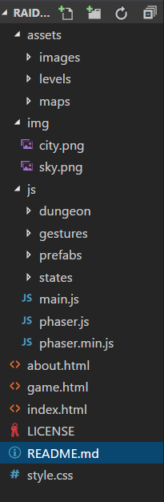

# RAIDER OASIS

# Presentación del proyecto
El proyecto expuesto a continuación expone de una forma breve el desarrollo de una practica universitaria para la asignatura "Juegos en Red" dentro de la Universidad Rey Juan Carlos. En este proyecto, se propone desarrollar un videojuego online multijugador que contenga, al menos, el uso de tecnologías API REST y WebSockets, así como el resto de implementación necesaria para la creación de un juego de estas características. 

Nota: Las siguientes lineas del documento unicamente describen la arquitectura del proyecto así de cambios realizados en el.

# Fase 1 - Equipo de desarrollo y temática del juego

## Descripción general
Juego multijugador online de aventura y rol. Ambientación basada en la exploración de ruinas egipcias donde el jugador deberá colaborar o competir con otros jugadores para derrotar a enemigos y conseguir valiosos tesoros.
## Mecánicas
Mecánica centrada en la exploración de mazmorras. El objetivo principal del jugador será recolectar tesoros a medida que derrota a enemigos o resuelve pequeños puzles que se le puedan presentar por el camino. Las mazmorras estarán definidas por diversas plantas, cada una compuesta por un número finito de salas que se generarán de forma aleatoria.

#### Sistema de Combate
Combate basado en la acción. El jugador podra realizar diferentes ataques a través del trazado de formas con el ratón sobre los enemigos, atacando cuerpo a cuerpo, o bien creando ataques mágicos u otros efectos especiales. Asimismo, también se podrá desplazar, y por tanto, esquivar, a través de clicks de ratón.

#### Sistema de progreso
El jugador prodrá progresar en el juego a través de la obtención de experiencia. Dicha experiencia es obtenible a partir de:
- Derrota de enemigos
- Hazañas y tesoros descubiertos

Complementariamente, también se podrán cambiar el equipamiento y armas del jugador, para así cambiar las estadísticas de combate. Más detalles de la economía del juego serán detallados en el documento de diseño de la Fase 2 del proyecto.

#### Sistema de modos de juego

Partiendo de está mécanica como base, podemos diferenciar dos modos principales de juego:
- Modo co-operativo "A por el jefe": modo en el que los jugadores co-operarán para conseguir avanzar por la mazmorra con el fin de acabar derrotando conjuntamente a un enemigo final. A pesar de que en este modo no se prioriza la competitividad, cada jugador tendrá su propia puntuación y ganará experiencia diferente según su destreza de juego.

- Modo competitivo "Cazatesoros": modo de juego más competitivo, donde el objetivo principal es conseguir la máxima puntuación al finalizar la partida. La principal fuente de puntuación consistirá en la obtención de tesoros escondidos por  la mazmorra, aunque los enemigos derrotados de forma adicional también serán añadidos a la puntuación final.

#### Sistema de interacción On-line
Los jugadores además de poder jugar unos contra otros a través de la red en los modos propuestos, podrán comunicarse entre ellos apartir de una pequeña interfaz con mensajes predeterminados que contenga: mensajes de animo, de estrategia, de ayuda, etc. Su objetivo es crear una via rápida y segura de comunicación que se centre solo en la comunicación necesaria para el juego.
Por otro lado, las partidas se organizarán en diferentes salas de jugadores, donde podrá haber desde un mínimo de dos, hasta un máximo de cuatro de ellos.

## Funcionalidades básicas del sistema
- Al iniciar una partida, el jugador deberá crear un usuario en caso de que no exista, donde el sistema deberá almacenar dicho usuario junto a sus datos para un uso posterior.
- Los datos de usuario contendrán datos como: avatar, nick, nivel, puntuación, equipamiento y objetos. El sistema podrá manipularlos de forma correcta y eficiente.
- El sistema contará con un chat con frases predeterminadas  para la comunicación entre jugadores.
- El sistema deberá sincronizar los datos entre los diversos jugadores, estando entre ellos la posición de estos, su avatar, vida, etc.
- El sistema soportará la existencia de diferentes salas para alojar partidas de jugadores. Dichas salas podrán ser tanto privadas (con un nombre y contraseña) como publicas, donde los jugadores se eligen de forma aleatoria.
- El sistema será capaz de responder a los diferentes tipos de navegares, adaptandose al dispositivo (responsive).
- Resto de requisitos necesarios para el desarrollo correcto de una partida como la descrita en este documento. Enfásis posterior de dichas carácterísticas en el documento de diseño de la Fase 2 del proyecto.

# Fase 2 - Desarrollo del juego en local 

## Pantallas

Desde cualquier pantalla se podrá acceder a todas las que se muestran en la cabecera de la página, que son: Home, Play, Profile, LeaderBoards y About

Al iniciar la aplicación, lo primero que se mostrará será la pantalla “Home”, que es la pantalla de registro del el usuario. Esta parte se implementará en la fase 3 de la práctica y por eso ahora mismo no se encuentra funcional. 

En “Play!” se ejecutará el script que contiene el videojuego programado con Phaser.

“Profile” y “LeaderBoards” permanecen inactivas ya que son pantallas que no se encuentran disponibles por el momento debido a la misma razón por la que el registro de “Home” no es funcional, y es que serán implementadas en fases posteriores.

Por último, la pestaña “About” redireccionará a una pantalla con información variada sobre nosotros y el juego desarrollado para la asignatura.

## Estructuración del código

Respecto al código, se usaron dos bibliotecas externas para implementar dos aspectos que se querían tener en cuenta en este proyecto: detección de formas mediante dibujo de líneas en el canvas, y creación de mapas procedurales (mazmorras con salas dispuestas de manera aleatoria).

El proyecto se divide en varias carpetas:
- Assets: contiene las imágenes que se usarán como el spritesheet del personaje principal y el tileset del mapa. También contiene         el archivo JSON para cargar los assets y los distintos archivos JSON de todos los posibles mapas que puedan ser generados. En           dichos documentos se guarda información como los tiles a usar, las colisiones, las posiciones de las puertas, del protagonista,         del enemigo, etc.

- Img: Imágenes usadas en el código HTML para el diseño de la web. Contiene la imagen 	del cielo y de la ciudad.

- Js:  Aquí están los archivos javascript que son usados en el desarrollo del juego. Esta carpeta se subdivide en otras para poder         establecer una mejor estructuración:

* Dungeon: El código de esta carpeta sirve para la generación de la mazmorra.

* Gestures: Esta es la biblioteca importada para el uso de detección de formas en el canvas.

* Prefabs: Información correspondiente a los elementos del juego: el personaje, las puertas de cada sala y una “clase” objeto             padre de la que heredan.

* States: Los distintos estados de Phaser que serán llamados para la ejecución del juego
        
En la raíz de esta carpeta se encuentran el main.js donde se inicializarán todos los estados y la documentación de phaser que           se ha utilizado.
        
En la raíz de la carpeta principal del proyecto están los documentos de formato html que tienen que ver con el desarrollo y diseño de la web y el index.html para iniciar la aplicación. Asimismo, se incorpora este mismo archivo README.md, con la especificación de licencias de librerías que se han usado y la hoja de estilos.css

# Fase 3 - Inclusión de backend con REST

## Navegación

Ahora aparece activa la pestaña Leaderboards, que redirige a una página donde se muestra una tabla con los usuarios con mejores puntuaciones. También se ha cambiado ligeramente la funcionalidad de la pagina index, de modo que el formulario de login y registro es totalmente funcional (al rellenar los campos y darle a registrar se crea un nuevo perfil de jugador con esos datos, mientras que si se pulsa el botón de login el servidor verifica los datos introducidos y loggea al usuario). Los cambios que pueden apreciarse dentro de la pestaña 'Play' son la aparición de una pantalla previa al propio videojuego que se encarga de la creación y generación de salas de juego, cada una con una mazmorra diferente creada de manera aleatoria. 

Si desde una pestaña diferente pulsamos en la misma sala, se obtiene la misma mazmorra con los mismos enemigos, puertas, obstáculos, tesoros y disposición de habitaciones pero sin la aplicación aún de WebSockets para una conexión entre jugadores.

Esto se consiguen en los estados de phaser que se han creado: SearchingLobby, LobbyState e InitDungeon. La pantalla de salas (o lobbies en inglés) solo acepta cuatro como máximo. Una vez creadas todas las posibles no se podrá generar ninguna más a no ser que sea eliminada cuando los jugadores la abandonen. Esto se ha aplicado mediante los conocimientos adquiridos durante las clases de teoría sobre API REST. Se ha creado un servidor con unas clases pensadas para almacenar datos de la mazmorra y ser llamadas desde el cliente con los métodos ajax correspondientes de jQuery. Estos métodos son GET y POST. DELETE aparece en el código implementado pero no funciona ya que necesitamos el uso de WebSockets, así que esperamos que en nuestro caso no se evalúe hasta la siguiente fase.

## Diagrama de clases y API REST

A continuación se muestra el diagrama de clases formado por el juego (game.html):
LEYENDA
- Verde: @RestController clases que implementan la API REST en el lado del servidor
- Amarillo: modelos de datos usados en las peticiones REST
- Azul: Estados implementados para Phaser
- Rosa: Clases generadoras de la mazmorra aleatoria
- Rojo: Clases encargadas del reconocimiento de trazos
- Naranja: Grupos de objectos para Phaser

Las peticiones por el lado del cliente son realizadas para conectar el cliente a una determinada mazmorra (LobbyState y SearchingLobby), y para actualizar puntuaciones del jugador (WinState). 

El diagrama de flujo de pantallas dentro de la aplicación es actualizado al siguiente:

Contiene las pantallas anteriores con la novedad de que ahora puede visitarse leaderboards para consultar puntuaciones y dentro de game.html se dispone de dos pantallas, una para unirse a una sala y otra para jugar.

## Instrucciones precisas para ejecutar la aplicación

Para ejecutar el videojuego será necesario abrir el directorio del proyecto en Spring Tool Suite de la siguiente manera:

Posteriormente a eso, se selecciona el archivo seleccionado en la imagen de abajo, click derecho y Run As -> Java Application

Una vez hecho todo lo anterior debe dirigirse a un navegador cualquiera (preferiblemente Chrome que es donde ha sido testeado todo el proyecto), y cargar la dirección localhost:8181.

**Para el sistema de login es necesario que el navegador permita el uso de cookies.**

Para registrar un perfil con el que jugar, simplemente hay que rellenar el campo de login con los datos deseados y pulsar en register. Una vez registrado, si se escriben los datos correctamente de nuevo y se pulsa el botón login, se abrirá la sesión y el juego guardará las puntuaciones en el perfil correspondiente.

# Fase 4 - Inclusión de WebSockets

## Protocolo Utilizado

Se ha implementado el uso de WebSockets en esta fase para un correcto funcionamiento del videojuego en modo multijugador. El WebSocket se crea en el cliente en el archivo main.js, y en ese mismo sitio se reciben los datos necesarios con el método onmessage(). 

Cuando sea necesario se mandarán los datos mediante .send al servidor. El servidor responderá de una manera u otra dependiendo del valor de una variable string llamada 'protocolo', que especificará los datos que se quieren trabajar en el WebSocket. Todo esto tiene lugar en PlayerHandler.java En concreto, se disponen de los siguientes posibles valores para 'protocolo':

- "createSala_msg": notifica a los clientes que no esten jugando de que se ha creado una sala
- "joinSala_msg": notifica al cliente que esta en una partida de que se le va a unir un jugador
- "door_msg": notifica al cliente que esta dentro de una partida de que el otro jugador ha cambiado de habitación
- "position_msg": notifica al cliente que esta dentro de una partida de la posición actual del jugador contrario
- "spawnentity_msg": notifica al cliente que esta dentro de una partida de un enemigo
- "updateentity_msg": notifica al cliente que esta dentro de una partida de que tiene que actualizar a un enemigo
- "endgame_msg": notifica a los jugadores de una misma partida de que el juego ha terminado.

## Actualización del diagrama de clases
A continuación se muestra un diagrama de clases actualizado con las clases implementadas para el manejo de WebSockets. La leyenda utilizada es similar a la del diagrama anterior:
- Verde: @RestController clases que implementan la API REST en el lado del servidor
- Naranja: modelos de datos utilizados
- Azul: Estados implementados para Phaser
- Rosa: Clases generadoras de la mazmorra aleatoria
- Rojo: Clases encargadas del reconocimiento de trazos
- Amarillo: Grupos de objectos para Phaser
- Azul cian: Handler para el manejo de WS

## Cómo iniciar el videojuego + Gameplay
Enlace al grupo de trabajo en trello: [fase 4 - juegos en red](https://www.youtube.com/watch?v=rAGSy2TmIhw&feature=youtu.be)

## Equipo de desarrollo

| Nombre | Correo URJC | Usuario Github |
|--------|--------|--------|
|Víctor Manuel Palma Morales|vm.palma@alumnos.urjc.es|vmpalmamorales|
|José Ángel Cívico Martos|ja.civico@alumnos.urjc.es|Gleanx|
|Nicolás Morales Berea|i.moralesb@alumnos.urjc.es|nichromatic|

